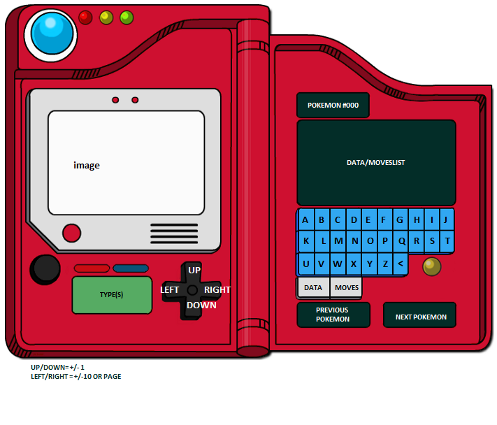

# pokedexapi

This is a build of a pokedex using html, css, javascript with ReactJS. Fetch from pokeAPI.
Sprites extracted from https://raw.githubusercontent.com/PokeAPI/sprites/master/sprites/pokemon
Here is the layout of what I'd imagin would be final outcome:
